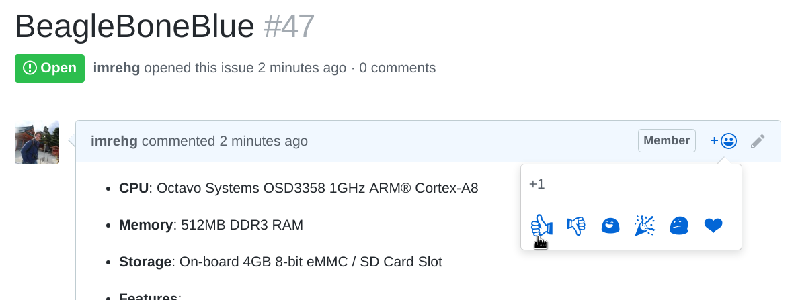

# resin-os-device-support
A list of current, proposed and planned future resin.io supported boards

Checkout our waffle.io board to track board support: 

## Suggesting a New Board

To submit or suggest a new board, create a new issue to this repo and include the following in the ticket:

**CPU:** Add CPU or SoC info of the board, architecture, etc.

**GPU:** Add GPU info if relevant

**Memory:** Amount of onboard RAM the board has

**Storage:** Add storage options if relevant, for example some boards boot from eMMC

**Features:** Any additional features the board has.

**Link:** A URL to more info about the board

It would also be very useful to know if the board already has a yocto BSP layer.

## Seconding a New Board Suggestion

If you find a board among the ones already suggested that you'd like to see supported,
you can second it by going into the issue, and adding a "thumbs up" to the issue
description. You can do that like this:

These thumbs up would help us recognize which boards are popular in the community and
direct our priorities!
